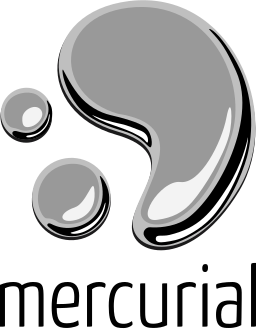

# A Quick Intro to Version Control

## What is Version Control?

* **CVCS** - Centralized Version Control System
    * *Old Way* - e.g.: Subversion (SVN)
* **DVCS** - Distributed Version Control System
    * *The **New** Way* - e.g.: Mercurial and **Git**

### Terminology

| Term | Meaning |
|:----:|:--------|
| **Repository** | "Database" with history of changes to your source code |
| **Commit** | A set of changes to source code saved as a "snapshot" |
| **Snapshot** | Algorithmic set of changes from a previous commit of your source |

## Why use Version Control?

* Code History
    * Timestamped "snapshots" of changes to your source code
* Divergent Paths of Development
    * Versioning & Branches
* Collaboration
* Automation

## DVCS - *The Options*

* **git** by Linus Torvalds (7 April 2005)
    * Linux, MacOS, etc
*  **Mercurial** by Matt Mackall (April 19, 2005)
    * Windows

* Both are **CLI** programs (*Command-Line Interface*)

## GitHub

 

* **Online Hosting** of git repositories
* **GitHub Desktop** - *Fall 2012* - Cross-Platform GUI for git
  * Eventually, both **Microsoft** and **Google** abandoned their existing online hosting solutions and moved to ***GitHub***

## Exploring Version Control

### Tools

* [**GitHub Desktop**](https://desktop.github.com) - https://desktop.github.com
* [**VS Code**](https://code.visualstudio.com) - https://code.visualstudio.com

### Task

* Documentation using **Markdown** syntax.

## Tutorial

<!-- _backgroundColor: black -->
<!-- _color: white -->
